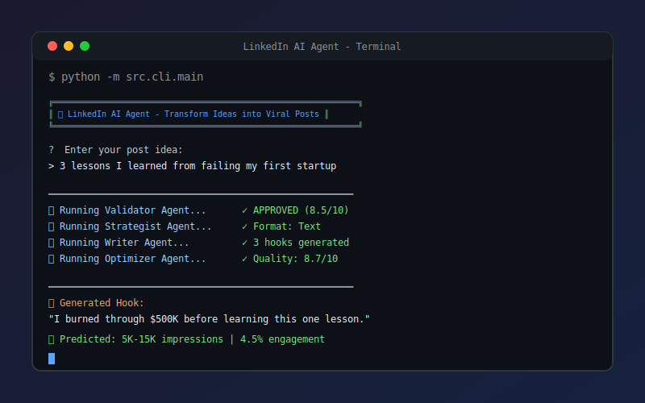

<div align="center">

# 🚀 LinkedIn AI Agent

### Transform Your Ideas into Viral LinkedIn Posts with AI

[](https://www.python.org/downloads/)
[](https://fastapi.tiangolo.com/)
[](https://opensource.org/licenses/MIT)
[](https://github.com/psf/black)
[]()

<p align="center">
  
</p>

[Features](#-features) • [Quick Start](#-quick-start) • [Architecture](#-architecture) • [API Docs](#-api-documentation) • [Contributing](#-contributing)

</div>

---

## 🎯 What is LinkedIn AI Agent?

LinkedIn AI Agent is a **production-ready, multi-agent AI system** that transforms your raw ideas into high-performing LinkedIn posts. Powered by **Google Gemini API**, it uses 5 specialized AI agents working together to:

- ✅ **Validate** your ideas for quality and brand alignment
- 📋 **Strategize** the best format, structure, and psychological triggers
- ✍️ **Write** compelling content with 3 hook variations
- 🎨 **Design** carousel specifications (8-10 slides)
- 📊 **Optimize** for maximum engagement with performance predictions

---

## ✨ Features

<table>
<tr>
<td width="50%">

### 🤖 Multi-Agent Architecture
Five specialized AI agents collaborate using LangGraph orchestration with intelligent routing and revision loops.

### 🔄 Swappable AI Models
Easily switch between Gemini 3 Flash (fast) and Gemini 3 Pro (powerful) based on your needs.

### 📚 RAG-Powered
Knowledge base of successful posts for inspiration, hook patterns, and structure templates.

</td>
<td width="50%">

### 🎯 Quality Scoring
Every post gets a quality score (1-10) with actionable improvement suggestions.

### 📈 Performance Prediction
AI predicts impressions and engagement rate based on content analysis.

### 🎨 Carousel Support
Automatic generation of 8-10 slide specifications with layouts and design notes.

</td>
</tr>
</table>

### More Features

- 🔐 **Rate Limiting** - Built-in protection (30 req/min)
- 💾 **PostgreSQL Storage** - Persistent storage for all posts and analytics
- 🚀 **Redis Caching** - Fast session state and caching
- 📝 **Interactive CLI** - Beautiful terminal interface with Rich
- 🌐 **REST API** - Full-featured FastAPI with OpenAPI docs
- 🐳 **Docker Ready** - One-command deployment with docker-compose
- 🧪 **Comprehensive Tests** - Unit, integration, and E2E tests

---

## 🛠️ Tech Stack

<table>
<tr>
<td align="center" width="96">

<br>Python 3.11+
</td>
<td align="center" width="96">

<br>FastAPI
</td>
<td align="center" width="96">

<br>PostgreSQL
</td>
<td align="center" width="96">

<br>Redis
</td>
<td align="center" width="96">

<br>Docker
</td>
</tr>
</table>

| Component | Technology | Purpose |
|-----------|------------|---------|
| **LLM** | Google Gemini 3 Flash/Pro | Content generation & analysis |
| **Orchestration** | LangGraph | Multi-agent workflow management |
| **Vector Store** | ChromaDB / Pinecone | RAG knowledge base |
| **Database** | PostgreSQL + SQLAlchemy | Persistent storage |
| **Cache** | Redis | Session state & rate limiting |
| **API** | FastAPI | REST endpoints with auto-docs |
| **CLI** | Rich + Click | Beautiful terminal interface |

---

## 🚀 Quick Start

### Prerequisites

- Python 3.11+
- [Google AI Studio API Key](https://makersuite.google.com/app/apikey)
- PostgreSQL (optional, uses SQLite fallback)
- Redis (optional, uses in-memory fallback)

### Installation

```bash
# Clone the repository
git clone https://github.com/yourusername/linkedin-ai-agent.git
cd linkedin-ai-agent

# Create virtual environment
python -m venv venv
source venv/bin/activate  # On Windows: venv\Scripts\activate

# Install dependencies
pip install -r requirements.txt

# Configure environment
cp .env.example .env
# Edit .env and add your GEMINI_API_KEY
```

### Run the CLI

```bash
# Interactive mode selection
python -m src.cli.main

# Basic mode (simple, fast)
python -m src.cli.main --basic

# Enhanced mode (see agent thoughts in real-time)
python -m src.cli.main --enhanced
python -m src.cli.main -e
```

### Run the API

```bash
uvicorn src.api.main:app --reload
# Visit http://localhost:8000/docs for interactive API docs
```

### Run with Docker

```bash
docker-compose up -d
# API available at http://localhost:8000
```

---

## 🏗️ Architecture

```
┌─────────────────────────────────────────────────────────────┐
│                     USER INPUT (Idea)                       │
└────────────────────────┬────────────────────────────────────┘
                         │
                         ▼
┌─────────────────────────────────────────────────────────────┐
│                    VALIDATOR AGENT                          │
│         Quality scoring • Brand alignment • Decision        │
└────────────────────────┬────────────────────────────────────┘
                         │ APPROVE
                         ▼
┌─────────────────────────────────────────────────────────────┐
│                   STRATEGIST AGENT                          │
│    Format selection • Structure • Clarifying questions      │
└────────────────────────┬────────────────────────────────────┘
                         │ + User Answers
                         ▼
┌─────────────────────────────────────────────────────────────┐
│                     WRITER AGENT                            │
│         3 hook variations • Body • CTA • Hashtags           │
└────────────────────────┬────────────────────────────────────┘
                         │
              ┌──────────┴──────────┐
              │                     │
              ▼                     ▼
┌──────────────────────┐  ┌──────────────────────┐
│    VISUAL AGENT      │  │   OPTIMIZER AGENT    │
│  (Carousel only)     │  │   QA • Predictions   │
│  8-10 slide specs    │  │   Brand consistency  │
└──────────────────────┘  └──────────────────────┘
                         │
                         ▼
┌─────────────────────────────────────────────────────────────┐
│                    FINAL OUTPUT                             │
│   Hook • Body • CTA • Hashtags • Quality Score • Predictions│
└─────────────────────────────────────────────────────────────┘
```

---

## 📖 API Documentation

### Endpoints

| Method | Endpoint | Description |
|--------|----------|-------------|
| `GET` | `/health` | Health check |
| `GET` | `/health/detailed` | Detailed component health |
| `POST` | `/api/v1/posts/generate` | Start post generation |
| `POST` | `/api/v1/posts/{id}/answers` | Submit answers to questions |
| `GET` | `/api/v1/posts/{id}/status` | Get generation status |
| `GET` | `/api/v1/posts/{id}` | Get generated post |
| `GET` | `/api/v1/posts` | List all posts |
| `POST` | `/api/v1/posts/generate/stream` | **NEW** Stream agent thoughts in real-time |
| `POST` | `/api/v1/posts/{id}/answers/stream` | **NEW** Continue generation with streaming |
| `GET` | `/api/v1/posts/{id}/agents` | **NEW** Get detailed agent outputs |
| `GET` | `/api/v1/posts/{id}/execution-log` | **NEW** Get raw execution log |

### Example Request

```bash
curl -X POST "http://localhost:8000/api/v1/posts/generate" \
  -H "Content-Type: application/json" \
  -d '{"raw_idea": "3 lessons I learned from failing my first startup"}'
```

### Example Response

```json
{
  "post_id": "550e8400-e29b-41d4-a716-446655440000",
  "questions": [
    {
      "question_id": "q1",
      "question": "What was the specific outcome?",
      "rationale": "Adds credibility with concrete results",
      "required": true
    }
  ],
  "original_idea": "3 lessons I learned from failing my first startup"
}
```

### 🆕 Streaming API (See Agent Thoughts)

The streaming endpoints use Server-Sent Events (SSE) to show real-time agent execution:

```bash
# Start generation with streaming
curl -N "http://localhost:8000/api/v1/posts/generate/stream" \
  -H "Content-Type: application/json" \
  -d '{"raw_idea": "3 lessons I learned from failing my first startup"}'
```

You'll receive events like:
```
event: agent_start
data: {"event_type": "agent_start", "agent_name": "validator", "message": "🔄 Validator agent is analyzing..."}

event: agent_complete
data: {"event_type": "agent_complete", "agent_name": "validator", "message": "✅ Validator completed in 1234ms", "data": {"summary": "Decision: APPROVE | Quality Score: 8.5/10"}}

event: complete
data: {"event_type": "complete", "data": {"status": "awaiting_answers", "questions": [...]}}
```

📚 **Full API documentation available at** `/docs` when running the server.

---

## 📁 Project Structure

```
linkedin-ai-agent/
├── 📁 .github/workflows/     # CI/CD pipelines
├── 📁 alembic/               # Database migrations
├── 📁 src/
│   ├── 📁 agents/            # 5 AI agents + base class
│   ├── 📁 api/               # FastAPI app & routes
│   │   ├── 📁 middleware/    # Rate limiting
│   │   └── 📁 routes/        # API endpoints
│   ├── 📁 cli/               # Interactive CLI
│   ├── 📁 config/            # Settings & constants
│   ├── 📁 database/          # Models & repositories
│   ├── 📁 llm/               # Gemini client
│   ├── 📁 models/            # Pydantic schemas
│   ├── 📁 orchestration/     # LangGraph workflow
│   ├── 📁 rag/               # Vector store & retrieval
│   ├── 📁 services/          # Cache & health
│   └── 📁 utils/             # Helpers
├── 📁 scripts/               # Utility scripts
├── 📁 tests/                 # Test suites
├── 📄 docker-compose.yml     # Docker services
├── 📄 Dockerfile             # Container definition
└── 📄 requirements.txt       # Dependencies
```

---

## 🧪 Testing

```bash
# Run all tests
pytest tests/ -v

# Run with coverage
pytest tests/ -v --cov=src --cov-report=html

# Run specific test suites
pytest tests/unit/ -v           # Unit tests
pytest tests/integration/ -v    # Integration tests
pytest tests/e2e/ -v            # End-to-end tests
```

---

## ⚙️ Configuration

| Variable | Description | Default |
|----------|-------------|---------|
| `GEMINI_API_KEY` | Google AI Studio API key | Required |
| `DATABASE_URL` | PostgreSQL connection string | SQLite fallback |
| `REDIS_URL` | Redis connection string | In-memory fallback |
| `CHROMADB_PATH` | ChromaDB storage path | `./data/chromadb` |
| `DEFAULT_MODEL` | Default Gemini model | `gemini-3-flash-preview` |
| `DEBUG` | Enable debug mode | `false` |

---

## 💰 Cost Estimation

| Model | Input | Output | Per Post |
|-------|-------|--------|----------|
| Gemini 3 Flash | $0.075/1M tokens | $0.30/1M tokens | ~$0.01-0.02 |
| Gemini 3 Pro | $0.50/1M tokens | $2.00/1M tokens | ~$0.05-0.10 |

**Estimated monthly cost**: $5-20 for moderate usage (100-500 posts/month)

---

## 🤝 Contributing

Contributions are welcome! Please read our [Contributing Guide](CONTRIBUTING.md) for details.

1. Fork the repository
2. Create your feature branch (`git checkout -b feature/amazing-feature`)
3. Commit your changes (`git commit -m 'Add amazing feature'`)
4. Push to the branch (`git push origin feature/amazing-feature`)
5. Open a Pull Request

---

## 📄 License

This project is licensed under the MIT License - see the [LICENSE](LICENSE) file for details.

---

## 🙏 Acknowledgments

- [Google Gemini](https://ai.google.dev/) for the powerful AI models
- [LangGraph](https://github.com/langchain-ai/langgraph) for agent orchestration
- [FastAPI](https://fastapi.tiangolo.com/) for the excellent web framework
- [Rich](https://rich.readthedocs.io/) for beautiful terminal output

---

<div align="center">

**⭐ Star this repo if you find it useful!**

Made with ❤️ by [Your Name](https://github.com/yourusername)

</div>
