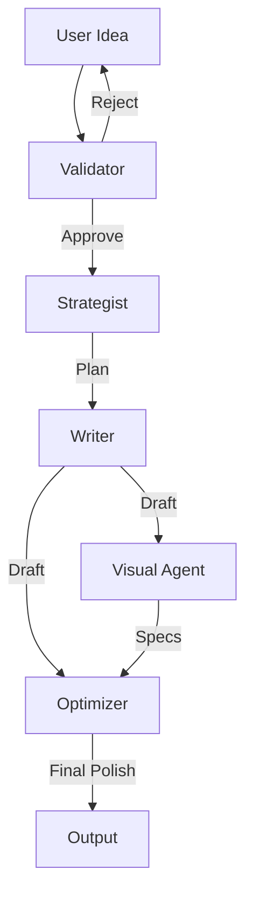

<div align="center">

# 🚀 LinkedIn AI Agent

### Transform Your Ideas into Viral LinkedIn Posts with AI

[](https://www.python.org/downloads/)
[](https://fastapi.tiangolo.com/)
[](https://react.dev/)
[](https://opensource.org/licenses/MIT)

<p align="center">
  <!-- Place a screenshot of the new frontend here -->
  
</p>

[Features](#-features) • [Quick Start](#-quick-start) • [Usage](#-usage) • [Architecture](#-architecture) • [API Docs](#-api-documentation)

</div>

---

## 🎯 What is LinkedIn AI Agent?

LinkedIn AI Agent is a **production-ready, multi-agent AI system** that transforms your raw ideas into high-performing LinkedIn posts. Powered by **Google Gemini API**, it uses 5 specialized AI agents working together to:

- ✅ **Validate** your ideas for quality and brand alignment
- 📋 **Strategize** the best format, structure, and psychological triggers
- ✍️ **Write** compelling content with 3 hook variations
- 🎨 **Design** carousel specifications (8-10 slides)
- 📊 **Optimize** for maximum engagement with performance predictions

---

## ✨ Features

- **🤖 Multi-Agent Architecture**: 5 specialized agents collaborating via LangGraph.
- **🖥️ Dual Interface**: Use the **Interactive CLI** for terminal lovers or the **Modern Web App** for a full graphical experience.
- **🔄 Session Restoration**: Resume your generation sessions even after server restarts.
- **📚 Post Library**: Save, manage, and revisit your generated posts.
- **🎨 Brand Profiles**: Customize tone, voice, and content pillars.
- **🔐 Google Authentication**: Secure login and user management.
- **📊 Analytics Dashboard**: Track your generation history and quality trends.

---

## 🚀 Quick Start

### Prerequisites

- Python 3.11+
- Node.js 18+
- [Google AI Studio API Key](https://makersuite.google.com/app/apikey)
- PostgreSQL & Redis (optional, defaults to SQLite/Memory)

### 1. Backend Setup

```bash
cd backend

# Create virtual environment
python -m venv venv
source venv/bin/activate  # On Windows: venv\Scripts\activate

# Install dependencies
pip install -r requirements.txt

# Configure environment
cp .env.example .env
# Edit .env and add your GEMINI_API_KEY
```

### 2. Frontend Setup

```bash
cd frontend

# Install dependencies
npm install

# Configure environment
cp .env.example .env
# Ensure VITE_API_URL points to your backend (default: http://localhost:8000)
```

---

## 💻 Usage

You can use the LinkedIn AI Agent via the Command Line Interface (CLI) or the Web Application.

### Option A: Web Application (Recommended)

1. **Start the Backend Server**:
   ```bash
   # From /backend directory
   uvicorn src.api.main:app --reload
   ```
   The API will start at `http://localhost:8000`.

2. **Start the Frontend Client**:
   ```bash
   # From /frontend directory
   npm run dev
   ```
   The app will open at `http://localhost:5173`.

3. **Login & Generate**:
   - Go to `http://localhost:5173`.
   - Log in with Google.
   - Click "Create New Post" to start the AI wizard.

### Option B: Command Line Interface (CLI)

The CLI provides a stream-lined, text-based interface for content generation.

```bash
# From /backend directory
python -m src.cli.main
```

**CLI Modes:**
- `python -m src.cli.main --basic`: Fast generation without detailed agent logs.
- `python -m src.cli.main --enhanced`: (Default) Shows real-time thoughts from every agent.
- `python -m src.cli.main --help`: View all available options.

### Option C: Docker (Full Stack)

Run the entire stack (Database, Cache, Backend, Frontend) with one command:

```bash
# From project root
docker-compose up -d
```
- Web App: `http://localhost:8000` (Backend servers static frontend files in Docker mode if configured, otherwise access Frontend container port)

---

## 🏗️ Architecture

The project follows a **Monorepo** structure:

```
linkedin-ai-agent/
├── 📁 backend/               # FastAPI, LangGraph, Database
│   ├── 📁 src/               # Application source code
│   │   ├── 📁 agents/        # AI Agent logic
│   │   ├── 📁 api/           # API Endpoints
│   │   ├── 📁 cli/           # CLI Tool
│   │   └── ...
│   ├── 📁 alembic/           # Migrations
│   └── 📄 requirements.txt
├── 📁 frontend/              # React + TypeScript + Vite
│   ├── 📁 src/               # UI Components & Pages
│   └── 📄 package.json
└── 📄 docker-compose.yml     # Orchestration
```

### Agent Workflow



---

## 📖 API Documentation

Full interactive API documentation is available when the backend is running:

- **Swagger UI**: `http://localhost:8000/docs`
- **ReDoc**: `http://localhost:8000/redoc`

---

## 🤝 Contributing

Contributions are welcome! Please check `CONTRIBUTING.md` for guidelines.

## 📄 License

MIT License - see `LICENSE` for details.
